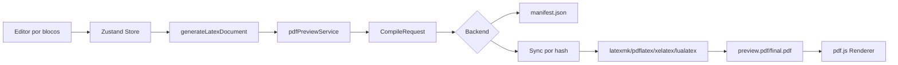
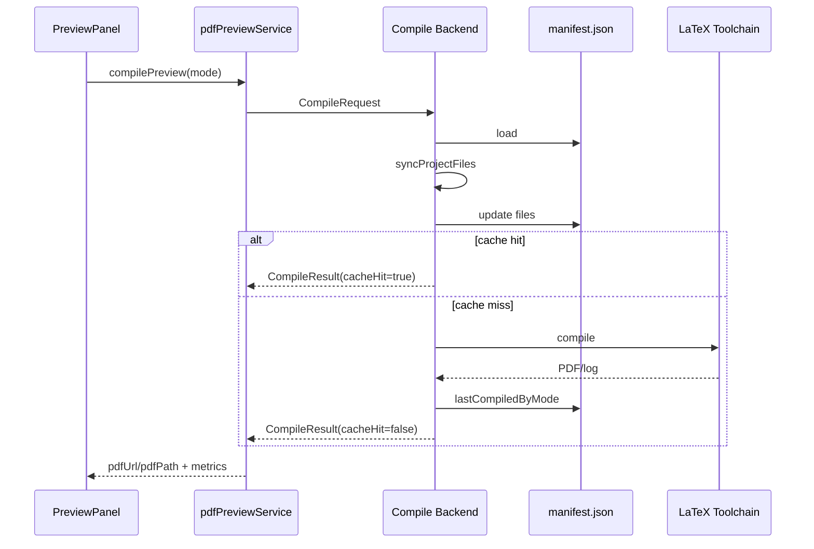

# Architecture

Leia tambem [AI_CONTEXT.md](./AI_CONTEXT.md), [COMPILATION_PIPELINE.md](./COMPILATION_PIPELINE.md) e [PROJECT_MANIFEST.md](./PROJECT_MANIFEST.md).

## Visao Geral

O EditorLatex separa responsabilidades em quatro camadas:

- Frontend React: edicao, preview visual, comandos de usuario e renderizacao PDF.
- Store Zustand: estado de documento, template, assets e preview.
- Servico de compilacao: contrato `CompileRequest`/`CompileResult`, sync de assets, cache e metricas.
- Backend Tauri/Node: persistencia do projeto, LaTeX local, manifest e PDF.

## Frontend

Arquivos principais:

- `src/main.tsx`
- `src/features/preview/components/PreviewPanel.tsx`
- `src/features/preview/lib/pdfPreviewService.ts`
- `src/features/preview/lib/pdfRenderer.tsx`
- `src/features/template-upload/services/overleafZipService.ts`

O frontend nao deve ser dono permanente de arquivos pesados. Ele pode carregar `binaryBase64` apenas temporariamente no fallback browser/dev. No Tauri, importacao ZIP deve usar backend-first.

## Store

Arquivos principais:

- `src/store/slices/previewSlice.ts`
- `src/store/slices/assetSlice.ts`
- `src/store/slices/templateSlice.ts`
- `src/store/storeHelpers.ts`

Responsabilidades:

- Controlar dirty state do TEX.
- Reutilizar `generatedTex` quando `texDirty === false`.
- Guardar metadados de assets, nao base64 permanente.
- Guardar metricas e diagnostics retornados por compilacao.

## Geracao TEX

O TEX nasce no dominio:

- `src/domain/latex/latexGenerator.ts`
- `src/domain/latex/blockRenderer.ts`
- `src/domain/latex/inlineLatex.ts`
- `src/domain/latex/escapeLatex.ts`

Regra: geracao de TEX deve ser deterministica para o mesmo documento. Evite timestamps, IDs aleatorios ou qualquer dado que invalide `sourceHash` sem mudanca real.

## Compilacao

Backends atuais:

- Node/Vite: `src/infrastructure/latex-compiler/latexCompiler.ts`
- Tauri/Rust: `src-tauri/src/lib.rs` com modulos `latex_compile.rs`, `project_manifest.rs`, `project_sync.rs`

Ambos devem receber `CompileRequest`, persistir/sincronizar arquivos, preservar cache quando possivel e retornar `CompileResult`.

## Cache

Cache e documentado em [CACHE_STRATEGY.md](./CACHE_STRATEGY.md). A regra arquitetural e: cache deve ser baseado em conteudo (`sourceHash`, hashes de assets, modo), nunca em tempo.

## Manifest

`manifest.json` e a fonte de verdade de arquivos persistidos por projeto. Ver [PROJECT_MANIFEST.md](./PROJECT_MANIFEST.md).

## pdf.js

`src/features/preview/lib/pdfRenderer.tsx` renderiza PDFs com range/stream habilitados. Nao reintroduzir `disableRange: true` ou `disableStream: true` sem medir e documentar.

## Tauri

Tauri e o backend final para desktop:

- importa ZIP diretamente;
- persiste projeto antes da primeira compilacao;
- fornece asset sob demanda;
- compila localmente;
- mantem manifest e cache persistentes.

## Backend de Compilacao

O backend deve decidir:

- quais arquivos escrever;
- quais arquivos remover;
- se ha cache hit;
- se deve chamar LaTeX;
- quais diagnostics/metricas retornar.

O frontend nao deve decidir persistencia real nem cache hit final.
