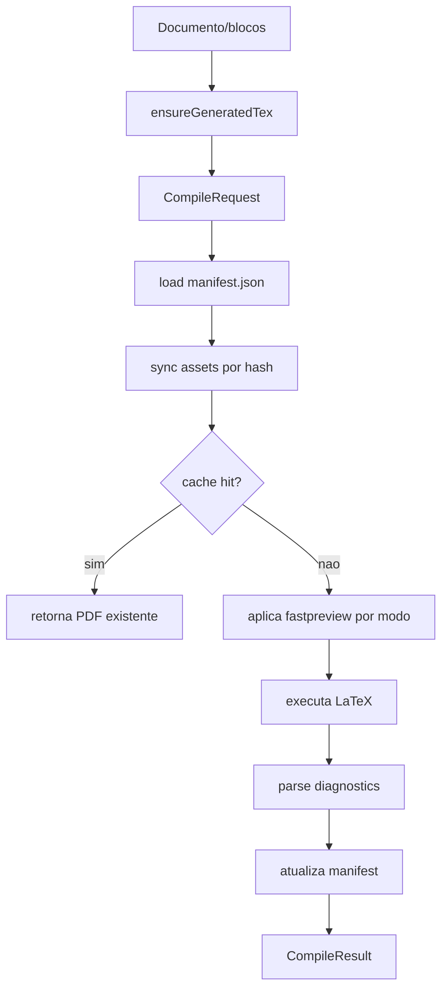

# Compilation Pipeline

Leia tambem [ARCHITECTURE.md](./ARCHITECTURE.md), [CACHE_STRATEGY.md](./CACHE_STRATEGY.md) e [PROJECT_MANIFEST.md](./PROJECT_MANIFEST.md).

## Modos

`CompileMode` esta em `src/features/preview/types/compileTypes.ts`:

```ts
export type CompileMode = "html-preview" | "pdf-preview" | "pdf-final";
```

## html-preview

Preview visual/HTML do editor. Nao deve chamar LaTeX. Deve usar o estado atual do documento e, quando possivel, o TEX gerado em cache.

## pdf-preview

Modo de preview PDF do painel. Por padrao deve ser fiel ao PDF exportado:

- usa `source/main.preview.tex`;
- usa `compile/main.preview.tex`;
- injeta `\newif\iffastpreview` e, na aba PDF, `\fastpreviewfalse`;
- preserva auxiliares no preview;
- grava PDF persistido em `output/preview.pdf`;
- nao deve remover elementos graficos quando `previewQuality=faithful`.
- usa caminho de compilacao equivalente ao final quando `previewQuality=faithful`, mantendo apenas a saida/cache de preview separados.
- pode condicionar elementos caros via `\iffastpreview` apenas quando `previewQuality=fast`.
- substitui definicoes decorativas conhecidas por stubs seguros apenas no preview rapido, quando necessario, como `\capaCustomizada` e `\PaginaFinalImagem`.
- insere placeholder visivel quando o corpo efetivo do preview rapido ficaria sem paginas.
- injeta `\graphicspath` com diretorios de assets do manifest quando o projeto importado veio de subdiretorio.

## pdf-final

Modo fiel para exportacao/validacao:

- usa `source/main.final.tex`;
- usa `compile/main.final.tex`;
- injeta `\newif\iffastpreview` e `\fastpreviewfalse`;
- grava PDF persistido em `output/final.pdf`;
- nao deve remover elementos visuais do template.

## CompileRequest

O frontend monta:

```ts
type CompileRequest = {
  projectKey: string;
  mode: CompileMode;
  revision: number;
  sourceHash: string;
  tex?: string;
  assetManifest?: AssetManifestItem[];
  assets?: CompileAssetPayload[];
  usePersistedProject?: boolean;
};
```

No fluxo frontend normal, `assetManifest` deve ser enviado. `assets` deve ser enviado apenas para arquivos novos, alterados ou ainda nao confirmados pelo backend.

No fluxo Vite/dev persistido da Etapa 9, o benchmark importa o ZIP primeiro com `POST /api/import-project-zip`. Depois disso, `CompileRequest` pode usar `usePersistedProject: true`, `assets: []` e `assetManifest: []`; o backend carrega `manifest.json`, le o TEX persistido e compila sem reenviar base64.

## sourceHash

`sourceHash` representa o conteudo compilavel: TEX original gerado e manifest de assets. Ele nao deve depender de `Date.now()`, URL, caminho temporario ou ordem nao deterministica.

## revision

`revision` e a revisao do documento no frontend. Ela ajuda a descartar respostas antigas e compor URL estavel, mas nao substitui `sourceHash`.

## Sync de Assets

O backend compara `assetManifest` com `manifest.files`:

1. arquivo novo: escrever em `assets/` e `compile/`;
2. hash diferente: reescrever;
3. hash igual e arquivo existe: pular;
4. arquivo ausente no manifest recebido: remover, exceto `tex`, `output` e `aux`.

## Cache Hit

Cache hit real exige:

- `sourceHash` igual;
- TEX efetivo transformado igual para cache em memoria do preview;
- manifest de assets sincronizado;
- PDF do modo existe;
- PDF do modo e renderizavel: tamanho maior que zero e header `%PDF-`;
- `lastCompiledByMode[mode]` aponta para o mesmo PDF;
- nada foi escrito/removido no sync.

Se houver cache hit, o backend nao deve chamar LaTeX.

Arquivos `output.pdf` vazios ou sem assinatura PDF nao podem ser retornados como sucesso. O backend deve ignorar esse candidato e continuar procurando outro PDF valido ou retornar falha de compilacao.

O TEX de `pdf-preview` tambem nao deve compilar com `No pages of output`. Se `\fastpreviewtrue` remover todos os elementos de pagina, o transformador deve inserir `\EditorLatexFastPreviewPlaceholder` para manter o preview renderizavel. Esse placeholder deve ser visualmente explicito; uma pagina tecnicamente valida mas branca e considerada falha de fallback.

Se o PDF fiel contem texto/operadores de desenho mas a UI mostra apenas uma pagina branca, investigue `PdfRenderer` antes de alterar LaTeX. O renderer deve desenhar o canvas mesmo quando a largura do container ainda nao foi medida.

## Resolucao de Assets LaTeX

Projetos importados do Overleaf frequentemente tem `main.tex` em um subdiretorio e referencias relativas simples:

```tex
\includegraphics{icone.png}
```

Como o EditorLatex compila `main.preview.tex` e `main.final.tex` na raiz de `compile/`, o backend deve injetar `\graphicspath` com os diretorios de assets conhecidos pelo manifest e o diretorio do `mainTexPath`.

Exemplo:

```tex
\graphicspath{{Relatório_de_maturidade/}}
```

Essa regra vale para Node/Vite e Tauri. Nao resolver isso no frontend e nao reescrever todos os `\includegraphics` manualmente.

## CompileResult

O backend retorna:

```ts
type CompileResult = {
  success: boolean;
  pdfUrl?: string;
  pdfPath?: string;
  revision: number;
  sourceHash: string;
  metrics?: CompileMetrics;
  diagnostics?: LatexDiagnostic[];
  latexDiagnostics?: LatexDiagnostic[];
  log?: string;
  syncedAssetHashes?: Record<string, string>;
};
```

## Fluxo Completo



## FastPreview e Macros Decorativas

O `pdf-preview` nao deve deixar corpos de macros decorativas parcialmente ativos. A transformacao deve remover ou substituir a definicao inteira por stub seguro:

```tex
\providecommand{\capaCustomizada}{}
\providecommand{\PaginaFinalImagem}[1]{}
```

Essa regra evita erros como:

```txt
Undefined control sequence.
l.51 \RodapeAtivofalse
```

Nesse caso, o corpo de `\capaCustomizada` executava `\RodapeAtivofalse` antes de `\newif\ifRodapeAtivo`. A correcao foi registrada pos-Etapa 9, antes da Etapa 10.

## Timeline Real da Etapa 8

Benchmark executado com `benchmark-results/editorlatex-benchmark.json` usando `c:\Users\Testing Company\Downloads\overleaf-main.zip`.

```txt
Compile Timeline

ZIP Read..............72.6ms
ZIP Extract...........209.8ms
ZIP Classify..........8.1ms
Main TEX Detection....0.5ms
Asset Hash............182.9ms
Request Serialize.....710.6ms
Request Round Trip....20023.1ms
Manifest Load.........nao alcancado
Asset Sync............nao alcancado
LaTeX.................nao alcancado
PDF Read..............nao alcancado
```

Conclusao: o timeout atual acontece durante o round trip da requisicao para o backend Vite com payload JSON grande, antes de `manifestLoadMs`, `assetSyncMs` ou `latexMs` existirem.

## Timeline Real da Etapa 9

Benchmark atualizado com `benchmark-results/editorlatex-benchmark.json` usando o mesmo `overleaf-main.zip`.

```txt
Importacao ZIP persistente

ZIP Read..............103.9ms
ZIP Extract...........403.2ms
ZIP Classify..........28.1ms
Main TEX Detection....155.4ms
Asset Hash............550.2ms
Write Files...........100608.4ms
Request Round Trip....102111.4ms

Preview rapido

Compile Request.......314 bytes
Manifest Load.........12.6ms
Write Files...........155.5ms
LaTeX.................7134.7ms
Total backend.........7710.5ms

Preview rapido cache hit

Compile Request.......314 bytes
Manifest Load.........11.6ms
LaTeX.................0.0ms
Total backend.........17.1ms

Preview final

Compile Request.......310 bytes
LaTeX.................7441.1ms
Total backend.........7486.3ms
```

Conclusao da Etapa 9: a compilacao Vite/dev nao envia mais o JSON monolitico de ~96.7 MB. A primeira importacao ainda e pesada, principalmente em escrita/leitura de arquivos persistidos, mas compilacoes posteriores usam payload minimo e conseguem medir LaTeX/cache de fato.
